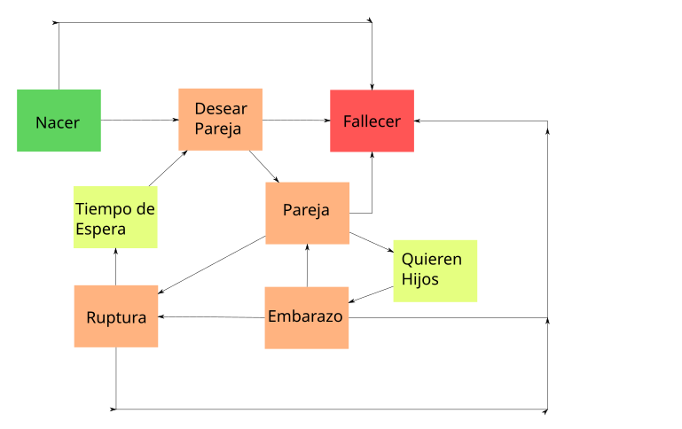

# Simulación

## Eventos Discretos

**Rodrigo Daniel Pino Trueba C412** 

### Resolución del Ejercicio 6

Se estudio el capitulo 3 del libro de la asignatura,

**Principales ideas seguidas para la solucion del problema** 

En este problema se dan unas tablas que indican los eventos a ejecutar y las probabilidades que estos se cumplan, no obstante no queda claro cuando dichos eventos se ejecuten. La idea a seguir fue realizar una maquina de estado, donde cada persona se mueve a traves de esta a su propio "ritmo" determinado por una variable uniforme. Ejemplifiquemos:

* Todas las personas mayores de 12 años se les asigna el evento desear pareja para una fecha en cierta cantidad de meses, la fecha exacta es determianda por una variable uniforme. Una vez llegado el evento, se aplican las tablas de probabilidades explicadas por el ejercicio y en el caso de cumplirse se le asigna el evento Emparejarse en una fecha determinada nuevamente por una variable uniforme. En caso de no cumplirse se le asigna nuevamente el evento Desear Parjea para más adelante en el tiempo.
* El evento pareja si se cumple, se forma una nueva pareja

Se recibe la cantidad de hombres y mujeres, se genera una poblacion con variedad de edad entre 0 y 100 como es orientado por el ejercicio.

Despues a las personas generadas mayores de 12 años se les da que se interesen en una persona en un rango determinado de timepo. Sirven a modo de eventos iniciales

Luego se deja andar la poblacion, cada persona funciona una maquina de estado que va cambiando probabilisticamente y bajo determinadas reglas.

Una imagen de la maquina de estado se muestra a continuación.

Todas las personas nacen, en el estado inicial y pasan a desear pareja. Cada cierto tiempo se les pregunta si desean pareja, si sí, se buscan a una persona en el mismo estaod y se vuelven parjea

Guiandonos por las tablas de la orientacion para cada estado de una persona, segun su edad, sea realizan los cambios. Como definimos el modelo fue, si una persona desea pareja, se hace el chequeo si va a estar interesado en tener pareja, si falla, se le vuelve a preguntar en tiempo uniforme de varios meses. Si la persona desea pareja, entonces se le annade en un evento en el tiempo donde busca una persona para empatarse. Llegado ese evento no se empata con nadie, pasa a desear pareja nuevamente, para buscar pareja otra vez.

Si el de embarazo se cumple entonces se pronostica un labour, un estado donde la mujer pare. Si falla se pronostica otro intento de embarazo para la pareja.

El de ruptura is OK se separa la pareja, y a cada uno se les annade un evento de desear pareja nuevamente, despues del tiempo que necesiten de soledad. Si no rompen, entonces se pronostica otro evento de ruptura mas adelante en el tiempo. El evento de ruptura solo se le aplica a las mujeres de la relacion, pues si se le aplicara ambos miembros tuvieran 2 eventos de ruptura, 2 posibilidades de romper.

Paralelo a estos estados las personas estan interactuand en otros 2 estados, hacerse viejo, o fallecer. A ojos de la simulacion, las edades importantes representadas por la tablas son 0 a 12, 12 a 15, 15 a .... de 60 a 76, de 76 a 125, por tanto estas personas no envejecen como en la realidad, en cambio, por etapas. Los ninnos acabados de nacer se mantienen en 0, hasta pasado 12 annos donde cumplen la mayoria de edad y se vuelven ninnos de 12 annos. Despues tienen que esperar 3 annos para cumplir el resto etc...

Cada vez que una persona llega a una etapa de edad se le averigua si muere en esta fecha o no, con las probabilidades que indican la tabla. Si muere llegada la fecha se extrae de la simulacion y si tiene pareja se le causa una ruptura. Note que se conozca la fecha de muerte de una persona, no implica que esta deje de continuar su simulacin como si esto no fuera a suceder.

La simulacion es una cadena de eventos, donde el estado "inicial" es desear pareja, despues que una persona desea pareja esta se mueve sola entre los estados, con su propio horario. Para el inicio de la simulacion a todos las personas mayores de 12 annos se les schedule el evento desar pareja en un rango de timpo determinado (No todos a la misma vez). Para las ninos de la poblacion incial  o los que nacen, una vez llegado a los 12 annos se les schedule el evento desear pareja, ya a partir de ahi toda la poblacion interactua sola.

Durante las varias ejecuciones se llega que en 100 annos la poblacion decrece a 1/3 del total, esto paso consistentemente varias veces y con poblaciones de distintos tamannos. Esto tienen sentido pues la cantidad de hijos que predominan en las parejas es de 1 o 2, luego la poblacion tiende mayoritariamente a mantenerse o decrecer, pues si dos personas solo producne otras 2 que seran su remplazo cuando estas mueran, la poblacion se mantiene. Existen casos de mas de 2 hijos pero son raros. Probando la simulacion donde todo el mundo quiere 10 hijos se tiene un baby boom, y crece considerablemnte la población. 

### Ejecutar

Se recomienda ejecutar en un ambiente con Python 3.9, con la biblioteca SortedContainers. El projecto se hizo con el gestor de dependencia poetry, en caso de querer el programa, es 

Poetry Install

Poetry Run Python src/main.py cantidad de mujeres candtida de hombres

